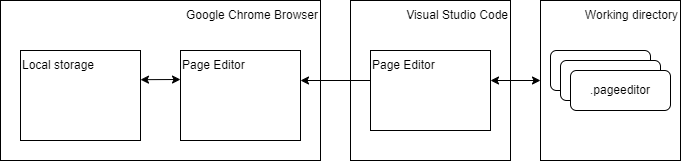
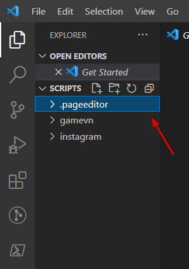
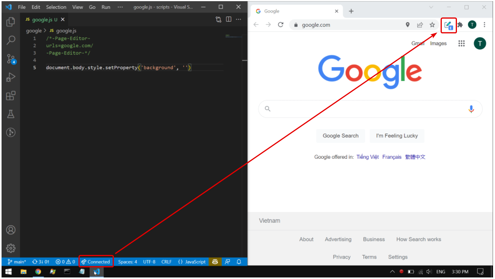

# Page Editor

A Google Chrome extension which enables to inject custom javascript scripts to any web page.

**Visual Studio Code** is integrated as an external powerful editor!

# Feature

- [X] Allow injected scripts to make [Cross-Origin HTTP Requests](doc/bypass_origin_http_request.md).
- [X] [Buit-in functions](doc/build_in_functions.md).
- [X] [Visual Studio Code as an external editor](doc/vscode_editor.md).

# Script Storage

All scripts are managed locally in a folder which I call `working directory` using Git, or any other file management I want.

The VSCode's extension takes the responsibility of pushing file changes from the `working directory` to the Chrome's local storage.

VS Code is required to open only if I want to update my scripts.

<p align="center">

</p>

# Script Configuration

- Each script file has it own configuration section beginning with `\*-Page-Editor-` and ending with `-Page-Editor-*/`. This section should be put at the top of script files.
- Configurations are pairs of key and value.

Example:
```
\*-Page-Editor-
urls=foo.com
-Page-Editor-*/
```

Available configuration.
1. `urls`
- List of urls that the script will be injected to.
- The list items are separated by semicolons.
- Urls can be matching by rules below:
  - `all` means any URL.
  - Ending by `*` means any url begins with the specified url.
  - Otherwise, exact same matching.

Example:
```
urls=foo.com;bar.com/foo/*
URLs below are affected:
- foo.com
- Any url starts with bar.com/foo/

urls=all;foo.com;bar.com;
All urls are affected.
```


# Setup

1. Open Google Chrome browser, load the extension in Developer mode.
2. Open Visual Studio Code, install another [Page Editor extension](https://github.com/VanDng/PageEditor-VSCode).
3. In Visual Studio Code, the extension automatically activates when the opened folder contains a folder named `.pageeditor`.
<p align="center">

</p>

4. Check the connection and ready to work.
<p align="center">

</p>


# Thanks

1/ Icons is downloaded from [FlatIcon](https://www.flaticon.com/).
